[![MIT License][license-shield]][license-url]

<br>
<p align="center">
  <h1 align="center">Deep Dream in PyTorch</h1>

  <p align="center">
    A simple implementation of Google Deep Dream in PyTorch
</p>

<br>

<p align="center">
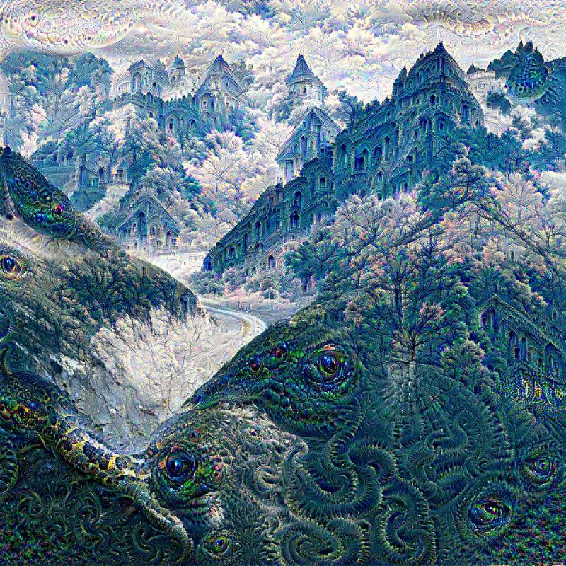

## Usage
Install requirements with:

``` sh
pip install -r requirements.txt
```

You will need Python 3.6+


You can create your own deepdream by running:

``` sh
./dream.py [img_name] [-m {googlenet, vgg}] [-g STEPS] [-o OCTAVES]
                [-s IMG_SIZE] [-j JITTER] [-l SINGLE_LAYER] [-y USE_MEAN_LOSS]
```

If you're happy with the default values, you can just run:

``` sh
./dream.py your_image.jpg
```

By default, this will create a deep dream image for each layer of a GoogLeNet model and save the resulting images as an image grid. If using the VGG19 model, one image for every third layer will be saved.

If you want to create a deep dream image for a single layer, use the ``` -l ``` flag, followed by the name of the layer. For VGG, this is an integer between 0 and 36, while for GoogLeNet valid layer names are the following:

* 'conv1'
* 'conv2'
* 'conv3'
* 'inception3a'
* 'inception3b'
* 'inception4a'
* 'inception4b'
* 'inception4c'
* 'inception4d'
* 'inception4e'
* 'inception5a'
* 'inception5b'

<br>

To get parameter descriptions and defaults, run:

``` sh
./dream.py --help
```

<br>

## Gallery 

<p align="center">

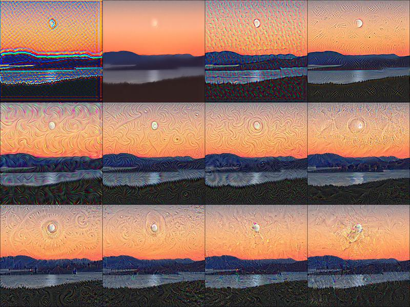
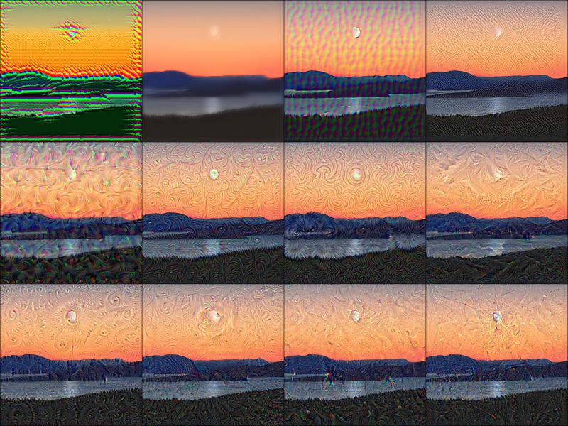

<br>

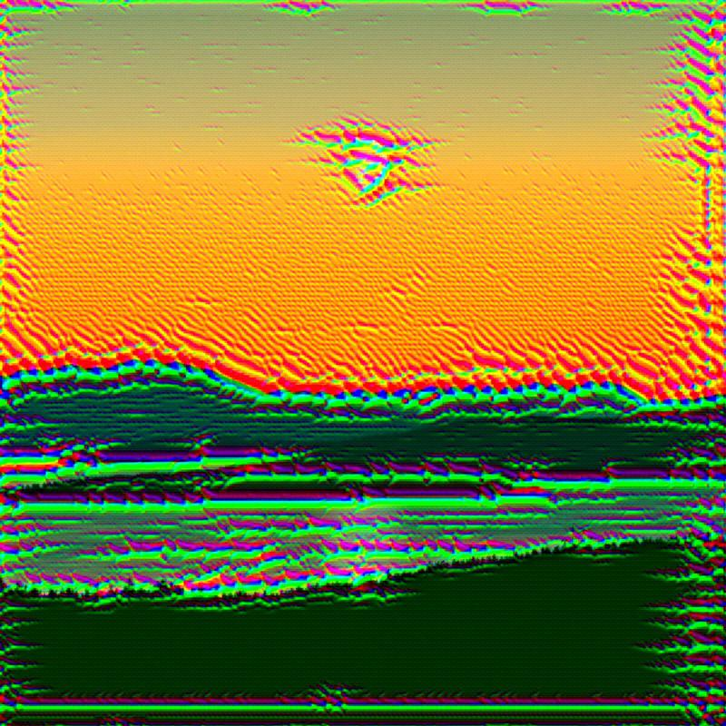


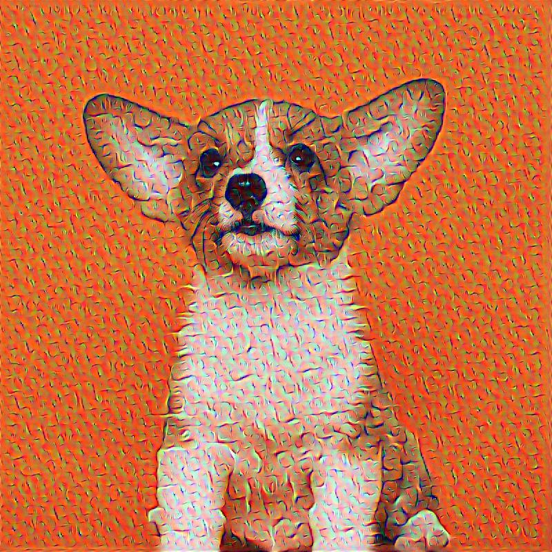

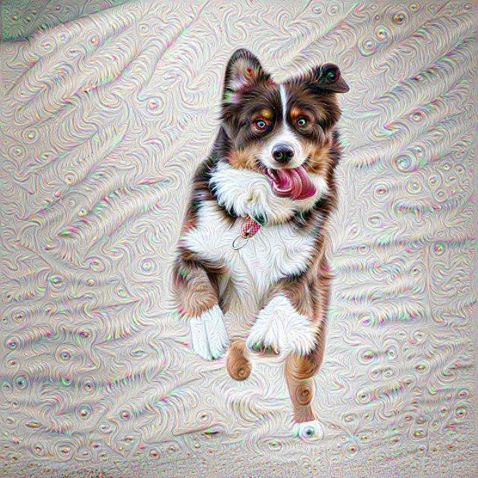


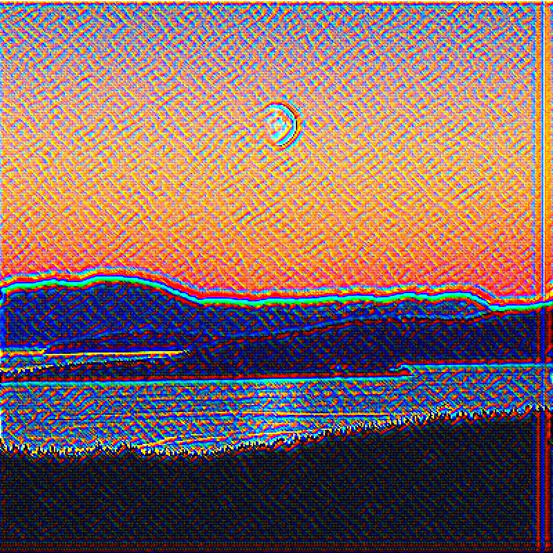


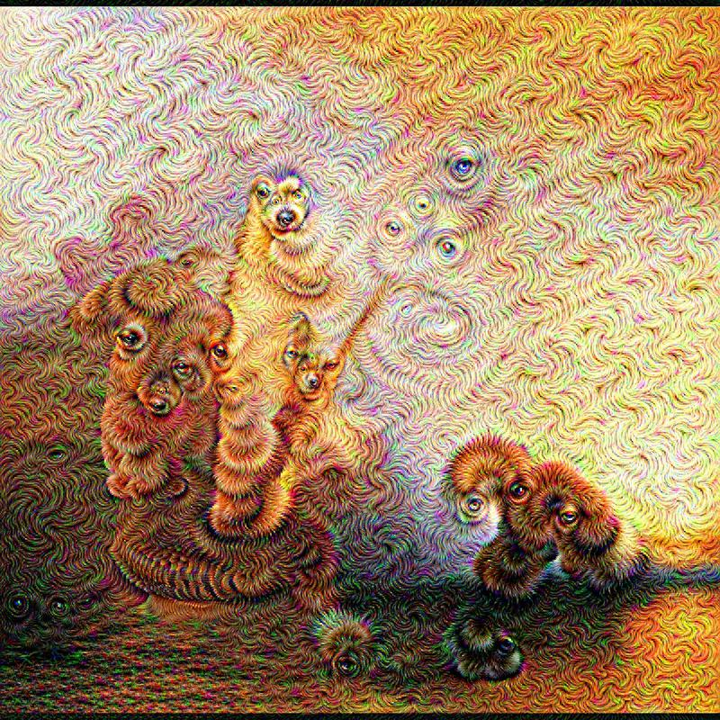
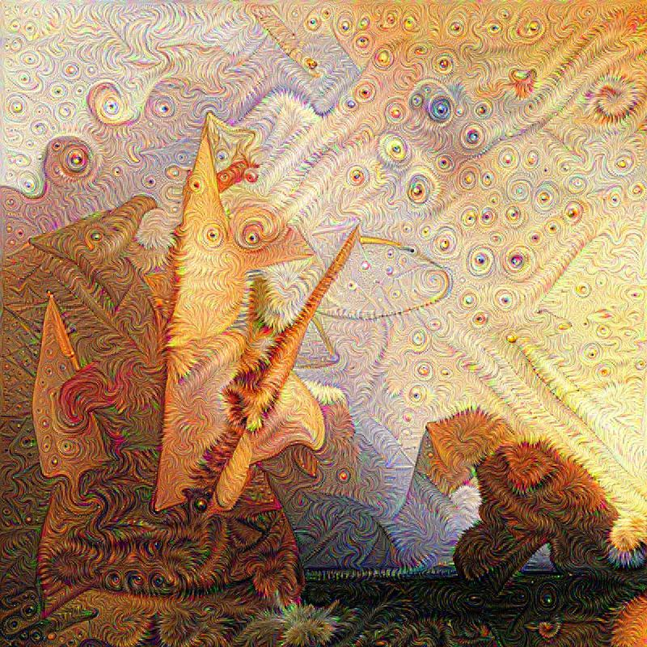

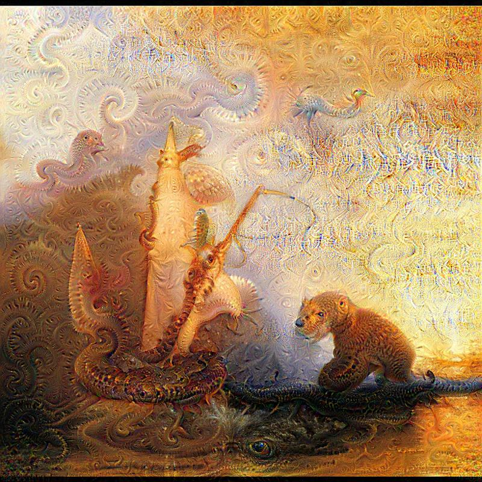
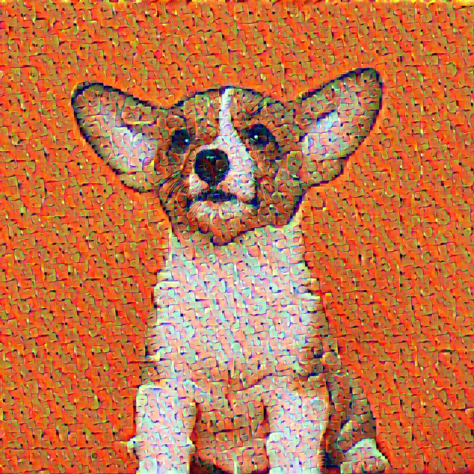


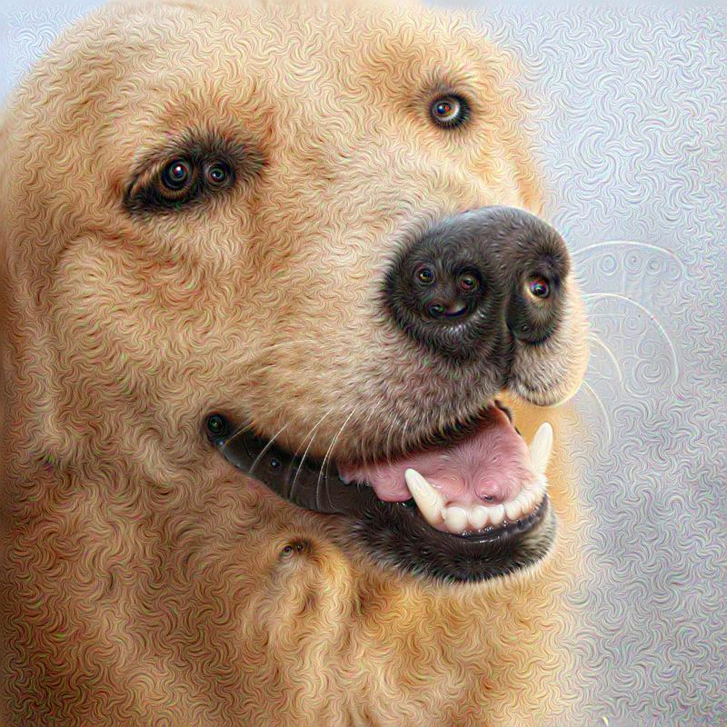

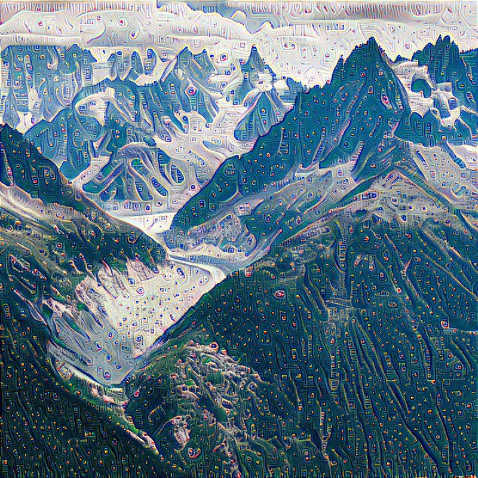
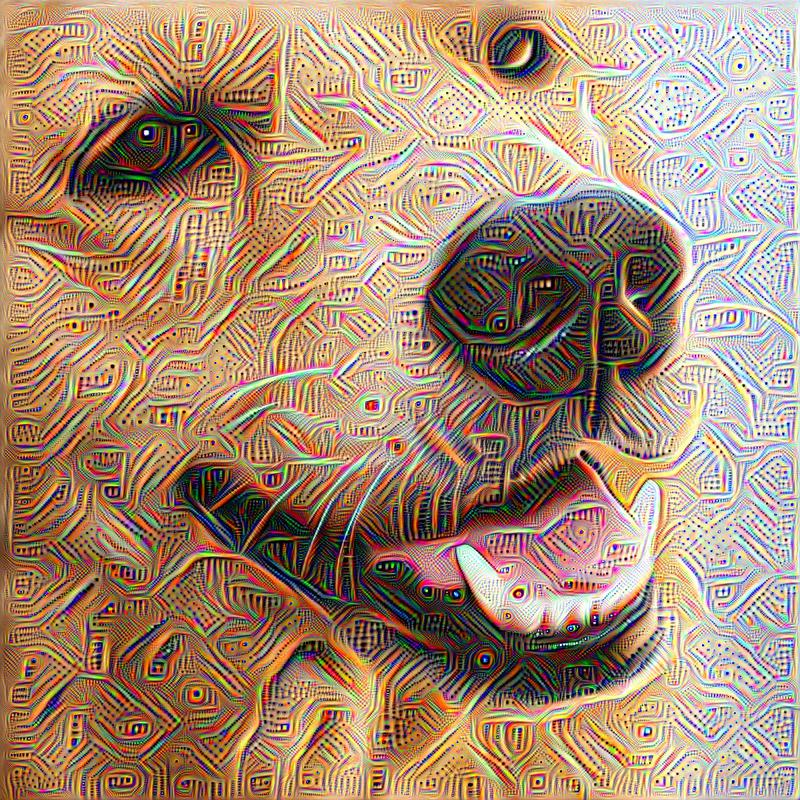

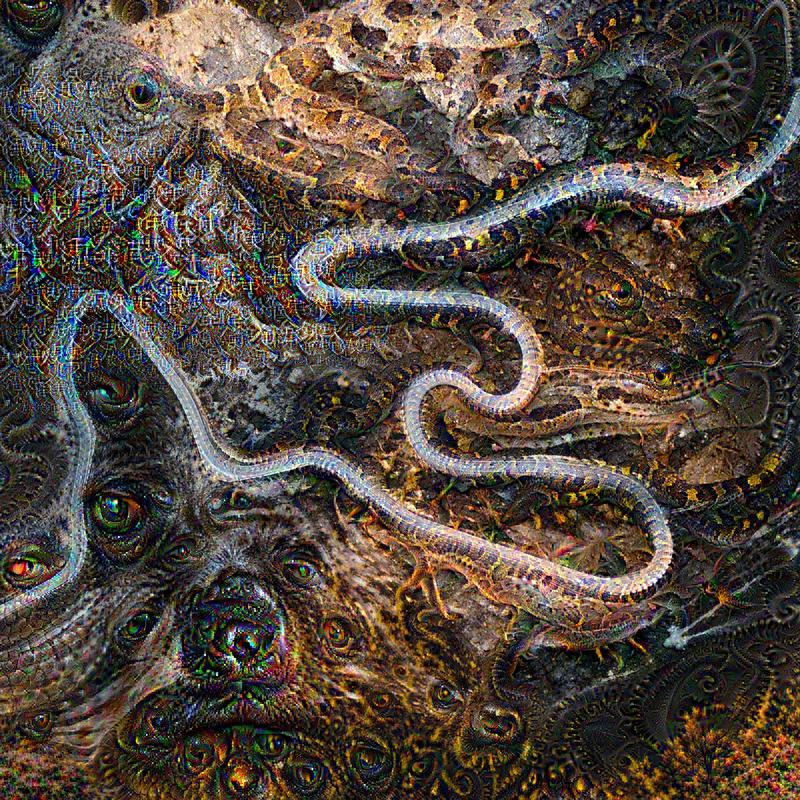
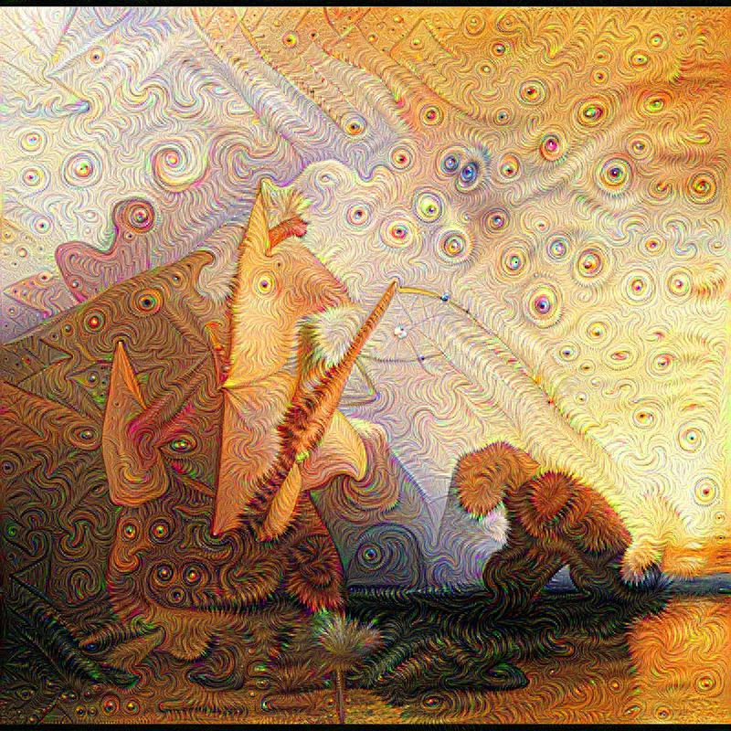


<br>

## Original images:
* [Simon Fitall on Unsplash](https://unsplash.com/photos/tvleqH3p1os)
* [Jordan Steranka on Unsplash](https://unsplash.com/photos/2-MmXpeN8YE)
* [Jack Anstey on Unsplash](https://unsplash.com/photos/zS4lUqLEiNA)
* [ipet photo on Unsplash](https://unsplash.com/photos/eoqnr8ikwFE)
* [Joséphine Menge on Unsplash](https://unsplash.com/photos/h7VBJRBcieM)
* [William Turner, Ulysses Deriding Polyphemus](https://en.wikipedia.org/wiki/Ulysses_Deriding_Polyphemus)
* [Wikivisual](https://www.wikihow.com/Stop-a-Dog-from-Jumping#/Image:Stop-a-Dog-from-Jumping-Step-6-Version-2.jpg)

[license-shield]: https://img.shields.io/github/license/othneildrew/Best-README-Template.svg?style=flat-square
[license-url]: https://github.com/othneildrew/Best-README-Template/blob/master/LICENSE.txt

